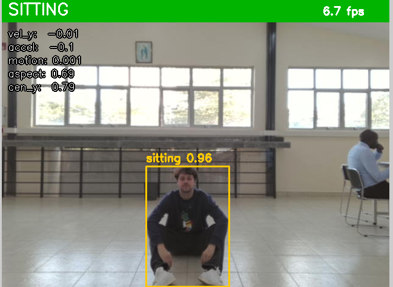
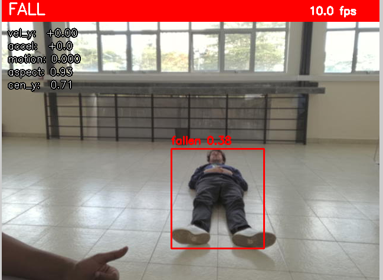
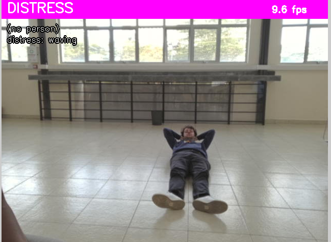
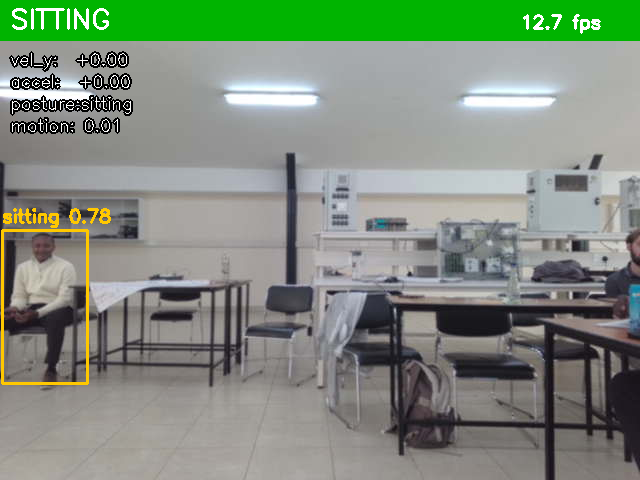
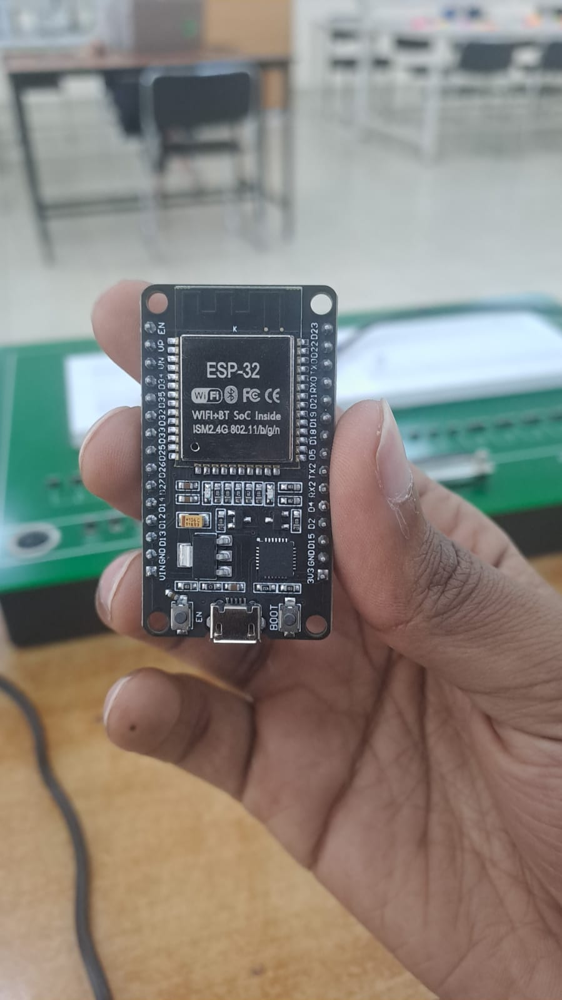
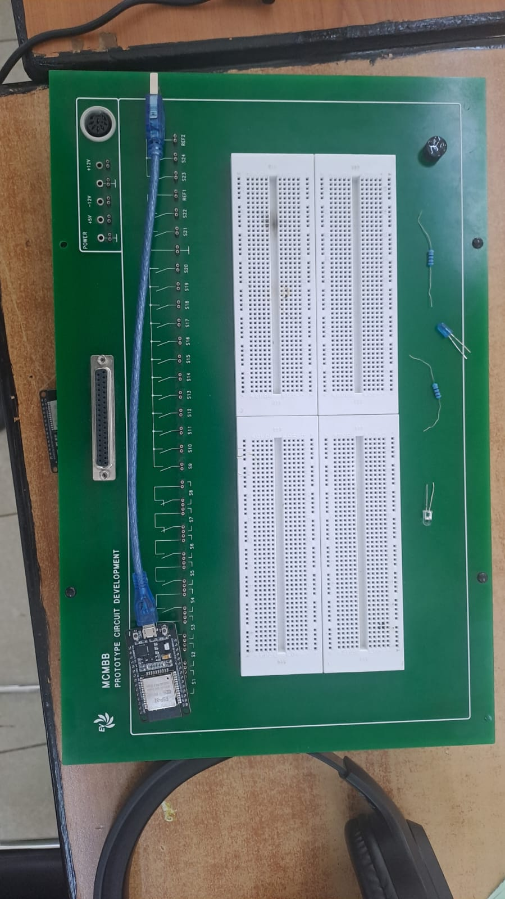
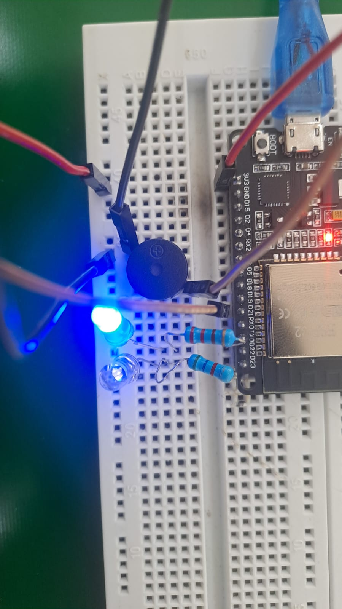

# Lazy Lobsters — Patient Fall Detection System

A real-time, privacy-safe fall and distress detection **prototype** for hospital wards, built by **Team Lazy Lobsters** (Malaika Lusamaki, Edouard Cossin, Azhar Ahmed) at the **SU-CESI Hackathon**. This is a hackathon proof of concept — it is not deployed in any actual ward.

## The problem

Fall-risk patients often go down unassisted and unwitnessed — most commonly while trying to reach the bathroom alone — and are found only when a nurse happens to pass by. Roughly 1 in 3 inpatient falls causes injury, and it's the *delay* before discovery, not just the fall itself, that drives the worst outcomes. Nurses can't watch every bed at once, and no existing system detects an unassisted fall, confirms it, and alerts the right person.

## What it does

A webcam feed is run through a pose-estimation and posture-classification pipeline that scores each frame against a rule-based state machine, entirely on-device:

```
Webcam → YOLO posture model + MediaPipe pose keypoints → feature extraction
       → fall/distress state machine → alert (snapshot + log + webhook/ESP32)
```

Instead of storing or transmitting raw video, the system reasons over body keypoints and bounding-box geometry — velocity, torso angle, aspect ratio, motion — so no identifiable footage ever leaves the device. When a fall or distress event is confirmed, it saves an annotated snapshot, logs it, and pushes an alert (webhook / physical ESP32 buzzer+LED / JSON status API) tagged with room ID and timestamp.

### States it recognizes

| State | Meaning |
|---|---|
| `STANDING` / `SITTING` | Normal activity — must never trigger an alert |
| `LYING` | Deliberately lying down (e.g. resting in bed) — not an alert |
| `FALLING` → `FALL` | A fast, uncontrolled drop followed by stillness on the ground |
| `DISTRESS` | A person on the ground (or seated) signaling for help — arms overhead or waving |
| `ABSENT` | No one in frame |

## Captured in testing

<table>
<tr>
<td width="50%">

<p align="center"><sub><b>SITTING</b> — normal activity, correctly not flagged</sub></p>
</td>
<td width="50%">

<p align="center"><sub><b>FALL</b> — collapse detected and flagged in red</sub></p>
</td>
</tr>
<tr>
<td width="50%">

<p align="center"><sub><b>DISTRESS</b> — a fallen person waving for help</sub></p>
</td>
<td width="50%">

<p align="center"><sub><b>SITTING</b> — auto-captured during an unattended test run</sub></p>
</td>
</tr>
</table>

## Hardware alert unit

Alongside the software pipeline, a physical **ESP32 + buzzer + red/blue LED** box gives an on-site alert even if no one is looking at a screen — solid blue for normal activity, slow red blink for a controlled lie-down, and a fast red blink with pulsing buzzer for a confirmed fall or distress event. See [firmware/README.md](firmware/README.md) for the wiring diagram and flashing steps.

<table>
<tr>
<td width="33%">

<p align="center"><sub><b>ESP32 DevKit</b> — driven over USB serial by the detector</sub></p>
</td>
<td width="33%">

<p align="center"><sub><b>Components</b> — ESP32, breadboard, buzzer, LEDs, resistors</sub></p>
</td>
<td width="33%">

<p align="center"><sub><b>Wired up</b> — blue LED lit for a normal (OK) state</sub></p>
</td>
</tr>
</table>

## Getting started

**Requirements:** Python 3.12, a webcam, and (on Linux) the `libgles2` system library for MediaPipe's GL context.

```bash
git clone <this-repo-url>
cd Lazy-Lobsters

# Linux only, one-time
sudo apt-get install -y libgles2

python3 -m venv venv && source venv/bin/activate
pip install -r requirements.txt
```

Run it against your webcam:

```bash
python src/run.py --source 0 --room-id ROOM-1
```

Or against a video file, saving the annotated output:

```bash
python src/run.py --source samples/fall.mp4 --save out.mp4 --no-display
```

Useful flags: `--no-esp32` / `--no-api` skip the physical alert unit and the JSON status API if you don't have that hardware attached; `--webhook <url>` forwards each confirmed event; see `python src/run.py --help` for the full list.

**Regression tests** (no camera needed — replays the scenarios below against the state machine):

```bash
python tests/test_detector.py
```

**Manual live-camera test protocol:** see [TEST_PROTOCOL.md](TEST_PROTOCOL.md).

## Project layout

```
src/            detection pipeline (pose, posture model, feature extraction, state machine, alerts)
tests/          camera-free regression tests for the state machine
web/            dashboard (React) and PHP status API
firmware/       ESP32 buzzer/LED alert unit
docs/           README assets
project.md      problem framing, stakeholders, architecture (full write-up)
PLAN.md         technical build plan
TEST_PROTOCOL.md  manual live-camera test checklist
```

## Team

Malaika Lusamaki · Edouard Cossin · Azhar Ahmed — SU-CESI Hackathon, Healthcare Automation track.
